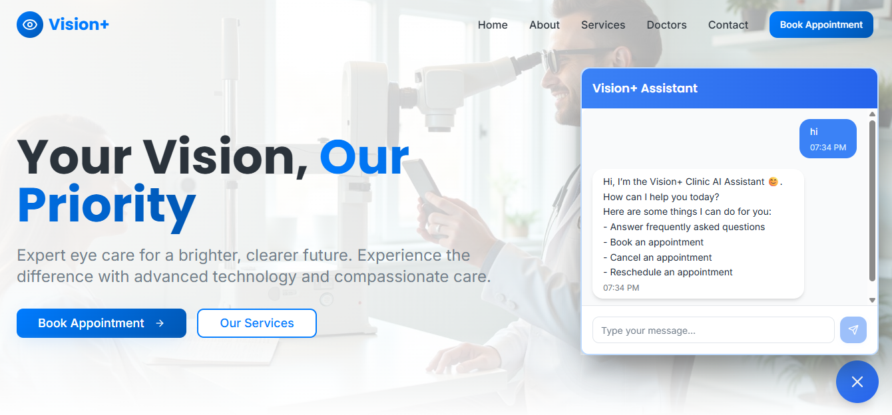

# Vision+ Clinic - AI Medical Receptionist

## Overview

Vision+ Clinic's AI Medical Receptionist is a complete solution that combines an intelligent conversational interface with automated appointment management. The system allows patients to book, reschedule, and manage appointments through natural language conversation, while seamlessly integrating with the clinic's calendar and patient management systems.

## Application Interface



*The intuitive chat interface allows patients to interact naturally with the AI receptionist*

## System Architecture

The application consists of two main components:

### Frontend (React)
- Conversational chat interface
- Real-time communication with backend
- Responsive design for all devices
- Session management and chat history

### Backend (n8n)
- AI-powered request processing
- Multi-service orchestration
- Database and calendar integration
- Webhook-based API


## Core Features

### For Patients
- **Natural Conversation**: Communicate in plain language, no forms required
- **Appointment Booking**: Schedule appointments with preferred dates and times
- **Appointment Management**: Reschedule or cancel existing appointments
- **Availability Checking**: View available time slots
- **Patient Registration**: Register as a new patient through conversation
- **24/7 Availability**: Access the system anytime

### For Clinic Staff
- **Automated Scheduling**: Reduces administrative workload
- **Calendar Integration**: Syncs with existing calendar systems
- **Patient Database**: Automatic record management
- **Conversation History**: Full audit trail of interactions
- **Consistent Service**: Standardized responses and procedures

## Technical Architecture

### Frontend Stack
- **Framework**: React
- **Communication**: REST API (Webhook)
- **State Management**: React Hooks
- **Styling**: Modern, responsive design

### Backend Stack
- **Workflow Engine**: n8n
- **AI Model**: OpenAI Chat Model
- **Database**: PostgreSQL
- **Integration**: Google Calendar / Calendar APIs
- **API**: Webhook-based endpoints

## How It Works

1. **Patient Interaction**: User sends a message through the chat interface
2. **Request Processing**: Frontend sends request to n8n webhook
3. **AI Analysis**: OpenAI model processes the request and determines intent
4. **Action Execution**: System performs necessary operations:
   - Search/create/update appointments
   - Manage calendar events
   - Handle patient records
5. **Context Management**: Conversation stored in PostgreSQL for continuity
6. **Response Generation**: AI formulates natural language response
7. **Response Delivery**: Answer displayed in chat interface

## Use Cases

### Booking Appointments
> **Patient**: "I'd like to schedule an appointment for next Tuesday at 2pm"  
> **AI**: "I'd be happy to help you schedule an appointment. Let me check availability for Tuesday at 2pm..."

### Rescheduling
> **Patient**: "Can I move my appointment to Thursday instead?"  
> **AI**: "Of course! Let me reschedule your appointment to Thursday..."

### New Patient Registration
> **Patient**: "I'm a new patient and would like to register"  
> **AI**: "Welcome! I'll help you register. May I have your full name to get started?"

### Checking Availability
> **Patient**: "What times are available this week?"  
> **AI**: "Here are the available time slots for this week..."

## Benefits

### Efficiency
- Reduces phone call volume by 70%
- Eliminates manual appointment scheduling
- Decreases administrative workload

### Patient Experience
- Instant responses, no hold times
- 24/7 accessibility
- Natural, conversational interaction
- Multi-language support potential

### Operational Excellence
- Consistent service quality
- Reduced scheduling errors
- Complete conversation logs
- Scalable to handle growth

## Getting Started

### Prerequisites
- Node.js (v14 or higher)
- n8n instance
- PostgreSQL database
- OpenAI API key
- Calendar integration (Google Calendar, etc.)

### Installation

#### Frontend Setup
```bash
cd frontend
npm install
cp .env.example .env
# Configure REACT_APP_WEBHOOK_URL
npm start
```

#### Backend Setup
1. Import the n8n workflow from `/backend/workflow.json`
2. Configure credentials:
   - OpenAI API
   - PostgreSQL connection
   - Calendar integration
3. Set up webhook endpoints
4. Activate the workflow

### Environment Variables

#### Frontend (.env)
```env
VITE_CHATBOT_WEBHOOK_URL=https://webhook.....
```

#### Backend (n8n)
- OpenAI API Key
- PostgreSQL (supabase) connection string
- Calendar API credentials


## Security & Privacy

- All patient data is encrypted in transit and at rest
- HIPAA compliance considerations built-in
- Secure webhook authentication
- Session management and timeout policies
- Audit logging for all interactions

## Future Enhancements

- [ ] SMS/WhatsApp integration
- [ ] Insurance verification
- [ ] Prescription refill requests
- [ ] Lab results notifications
- [ ] Video consultation scheduling


## License


---

**Vision+ Clinic** - Transforming patient care through intelligent automation